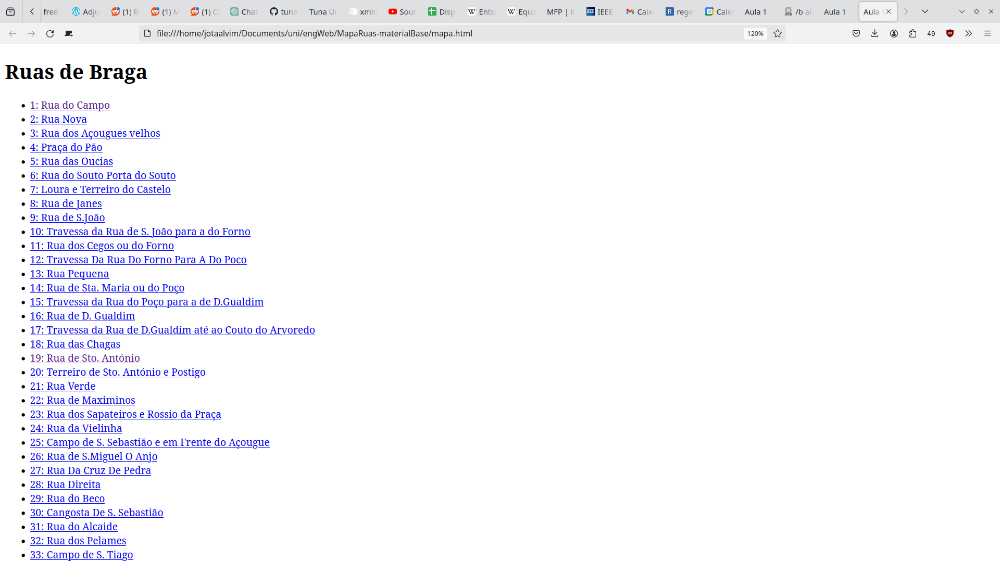
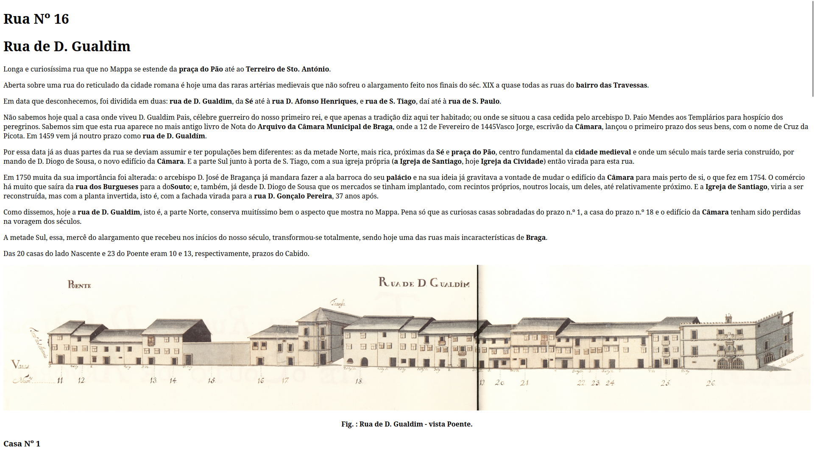
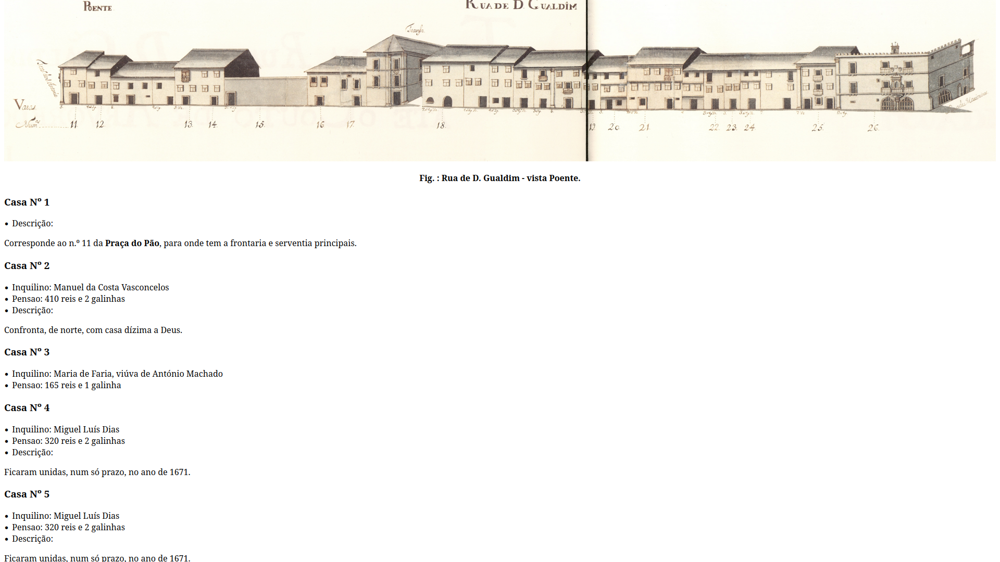

# Eunciado Mapa de Ruas de Braga

Criar uma página com a lista de ruas, depois para cada rua criar a sua própria
página com a informação dela.

# Processamento XML

https://pypi.org/project/xmldt/

A ideia é fornecer uma função que trata cada tag diferente

# pydt file.xml
devolve informação sobre as tags que existem. Devolve um esqueleto em python para um programa

# pydt -i file.xml 

```
MapaRuas-materialBase$ pydt -i texto/MRB-01-RuaDoCampo.xml 
•  _ROOT
   •  rua ( {http://www.w3.org/2001/XMLSchema-instance}noNamespaceSchemaLocation(1) )
      •  meta
         •  número
         •  nome
      •  corpo
         •  figura ( id(2) )
            •  imagem ( path(2) )
            •  legenda
         •  para
            •  lugar
            •  data
            •  entidade ( tipo(3) )
         •  lista-casas
            •  casa
               ...número
               •  enfiteuta
               •  foro
               •  desc
                  ...para [ lugar data entidade ]

```

# Resultados



---



---


