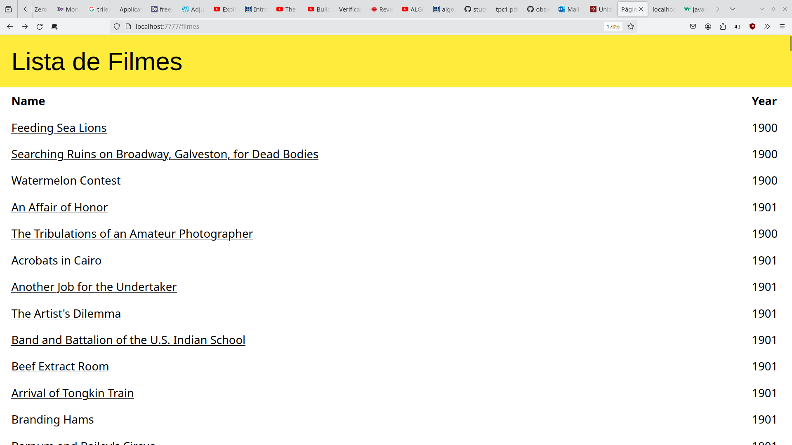
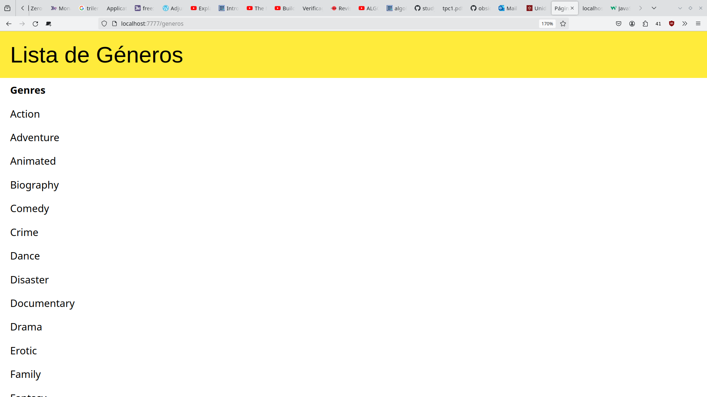
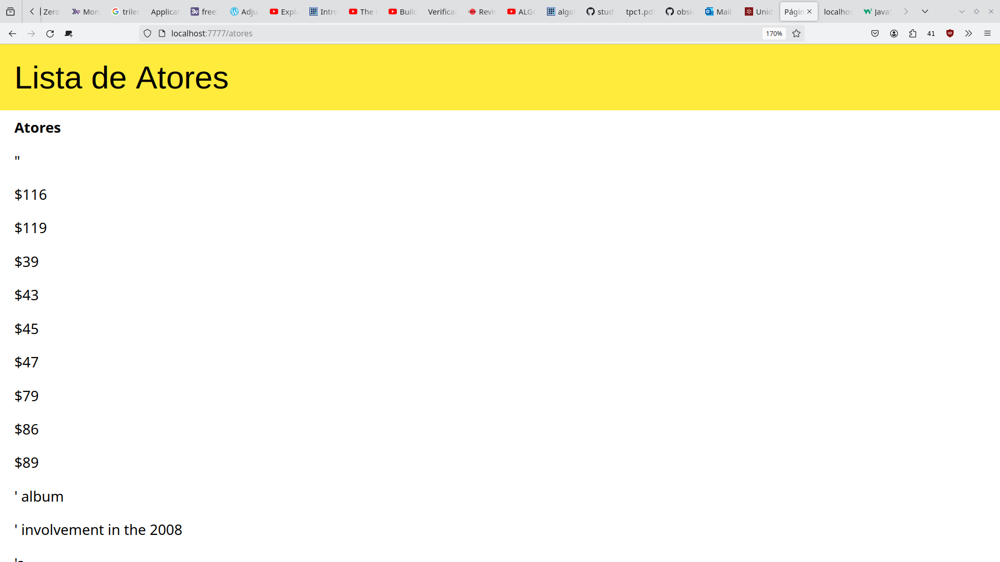
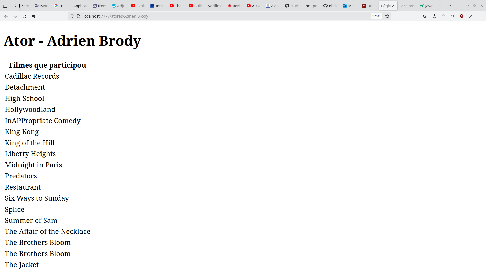

# TPC

análise do dataset e criação de BD em json-server

filme
    cast * 
    género *
    title
    year


Serviço que responde as seguintes rotas:

GET /filmes  -- listagem de filmes (cada é link para a página dele)
    /filmes/idFilme

    /generos
    /generos/idGen
    /ator
    /ator/idAtor


# correção json
 Usei um find-replace do vim para colocar uma virgula no fim de cada dicionario e tranformei o meu json numa lista de dicionários
```
:%s/}$/},
```


# Resultados



---



Este data set tem muito ruído, por isso quando ordeno os atores fica muito lixo todo no início
---



--- 



