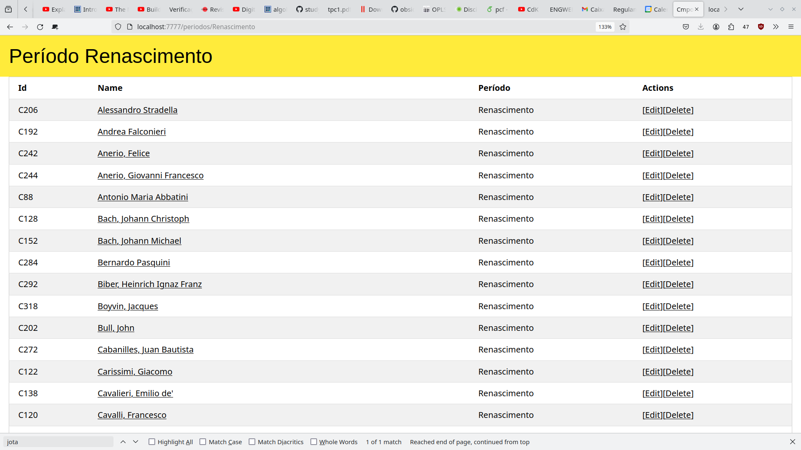

# TPC4
dataset = compositores.json

- colocar o datast no json-server
- Rotas importantes:
  - /compositores
  - /compositores/{id} -> o id é um parâmetro por estar dentro das chavetas
  - /compositores?periodo={periodo}
  - /periodos
  - /periodos/{id}
  - / 

- Implementar um serviço com as operações de CRUD sobre compositorese e sobre periodos

---

# Resultados
Consegui fazer as rotas todas incluindo a ediçao, adição e remoção

---

Este data set tem muito ruído, por isso quando ordeno os atores fica muito lixo todo no início
---

--- 

--- 

